# Masjid-E-Rizwan
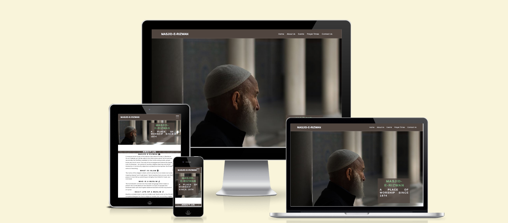
---
## User stories

- As a First Time Visitor, I want to easily understand the main purpose of the site, so I can learn more about the Mosque and Islam.
- As a First Time Visitor, I want to be able to easily navigate through the website, so I can find the content.
- As a First Time Visitor, I want to see the upcoming events to participate.

- As a Returning Visitor, I want to see information about prayer times.
- As a Returning Visitor, I want to find a way to get in contact with the Mosque, so that I can ask additional questions.
- As a Returning Visitor, I want to find community links, so that I can learn more about Masjid-E-Rizwan.

- As a Frequent User, I want to check whether there are any changes with Prayer times as they change daily.
- As a Frequent User, I want to have options for the reason to contact the company, so I can get an explicit answer to my email. 

---
## Technologies Used

- HTML
- CSS
- Font Awesome icons
- Google fonts
- Visual Studio Code
- Canva
- Git
- GitHub
- Balsamiq Wireframes

---
## Design

### Wireframe

- Desktop Mockup
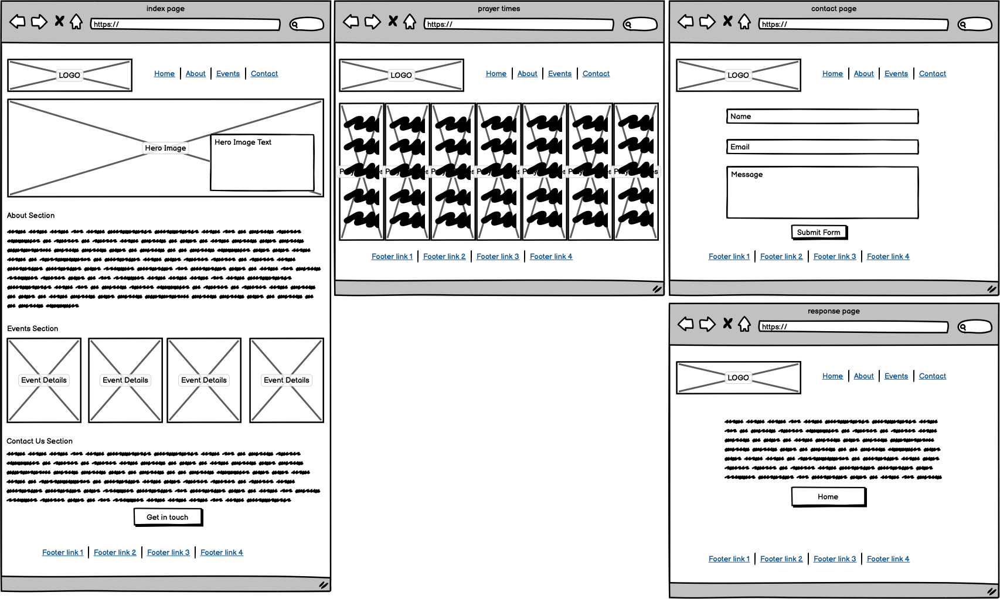

- Mobile Mockup
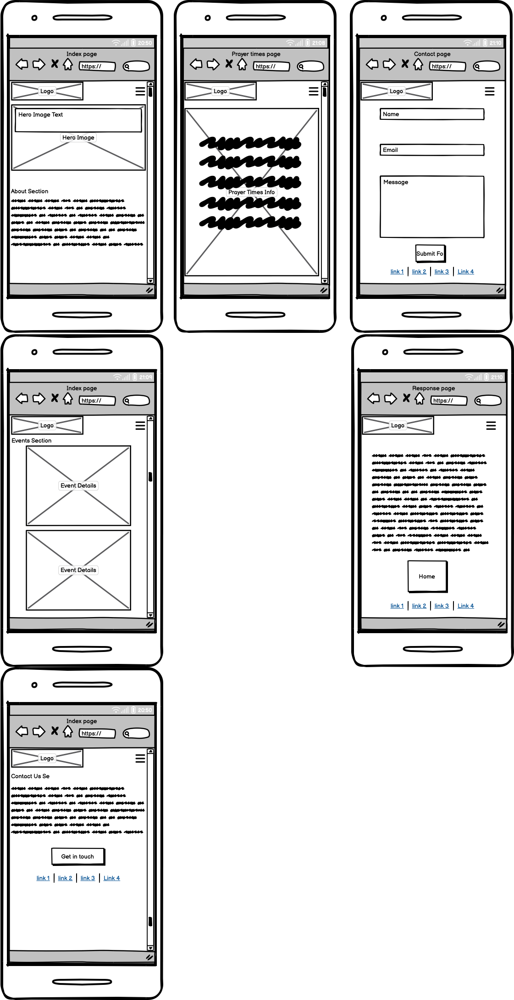

### Color Scheme

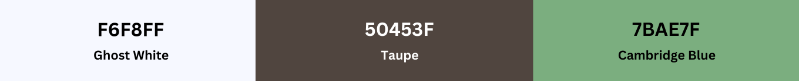
- Main color 60% of site #F6F8FF Ghost White
- Secondary color 30% of site #50453F Taupe
- Action Color 10% of site #7BAE7F Cambridge blue

### Typography

- Google Fonts
    - [Arimo](https://fonts.google.com/specimen/Arimo?query=arimo) - used for heading and logo
    - [Poppins](https://fonts.google.com/specimen/Poppins?query=poppins) - used for remaing body text

---
## Features

### Consistant Features
- Nav Section
    - Positioned at the top of the page.
    - Contains logo of the company on the left side which also acts as a link back to home page.
    - Contains navigation links on the right side:
        * Home - link back to home page.
        * About Us - link to home page about section with smooth scroll.
        * Events - link to home page events section with smooth scroll.
        * Prayer Times - Link to page that displays 5 daily prayer for the week.
        * Contact Us - link to the contact form page.
    - The links have animated hover effect.

    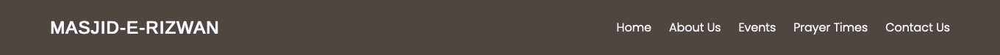

- Footer Section
    - Footer contains social media links that open in a new tab.
​
    
### Home Page
+ Hero Section
    - Hero section have a fixed background image with animation on load.
    - Hero section have the block section below the image that consist:
        * The name of the mosque.
        * The year the mosque was first opened.
    
    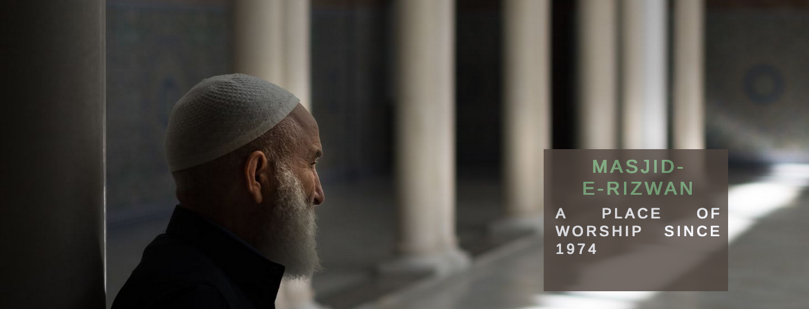

+ About Us Section
    - About Us Section has 4 short paragraphs.
    - Tells website visitors basic information regarding the mosque and Islam.

    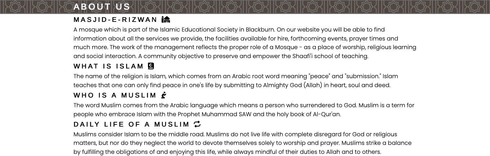

+ Events Section
    - Events Section has five current activities held at the mosque.
    - Each event has a day and time assigned.
    - One image spans accoss all events for desktop view.
    - Each event include a font awesome icon.

    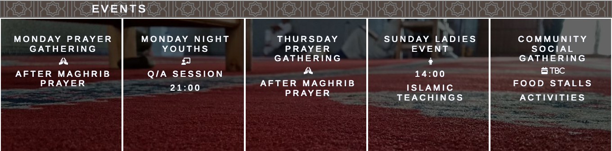

+ Contact Us Section
    - Contact Section has an explicit message for the visitors of the website to contact the company.
    - Is also has a button that directs to the contact page.
​
    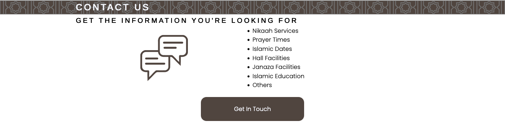

### Prayer Times Page

+ Display 5 daily prayers for a week
    - Heading for each day.
    - Same background image for each day.
    - Displayed as float with 2 days displayed in a row for smaller resolutions.
    - Each days contains the 5 daily prayer start time and Jamaat(congregation) time.
    - Every prayer is set with the taupe background color
    - Jamaat time color set with call to action color

    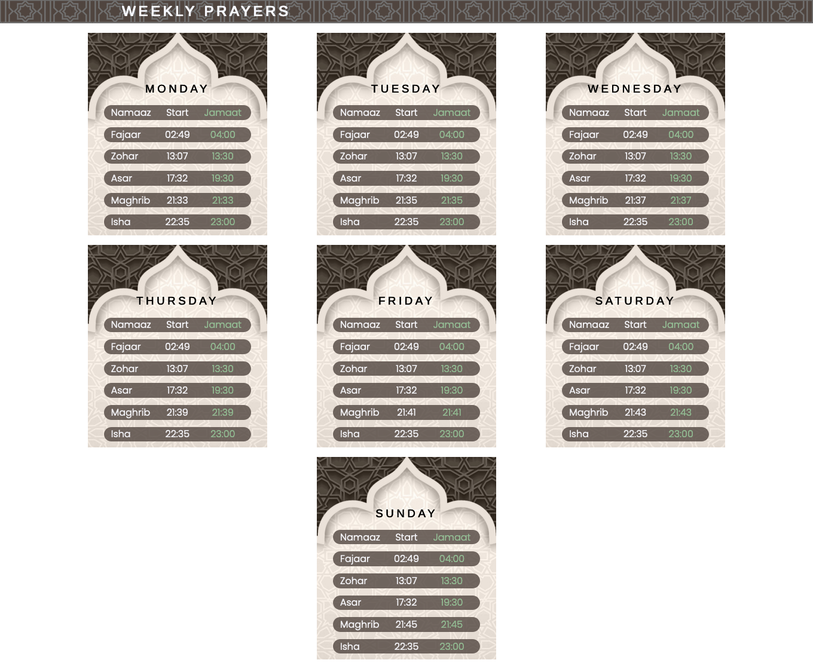

### Contact Page

+ Contact Form
    - Background image to span across page
    - form is centered on page.
    - form background set to blur background
    - All 3 input fields are requried
    - Form submit button having icon animation hover

    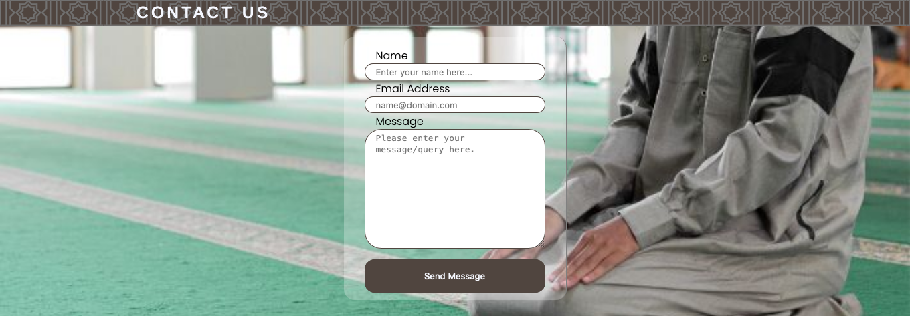

### Response Page

+ Success Message Response
    - Background image to span across page same as contact page
    - Success message styled to look it replaced contact form.
    - Success message background set to blur background
    - Set to redirect to home page in 5 seconds
    - Home page button link also added

    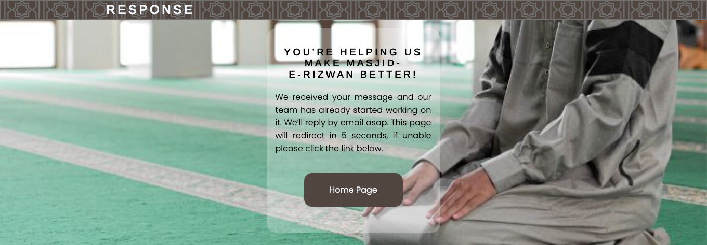

---
## Testing

### Home Page
- Manually tested all links working correctly
- Manually tested all hover effects working correctly
- Manually tested responsive display

### Prayer Times Page

- Manually tested all links working correctly
- Manually tested all hover effects working correctly
- Manually tested responsive display

### Contact Page

- Manually tested all links working correctly
- Manually tested all hover effects working correctly
- All form required fields tested
- form submit button tested
- Manually tested responsive display

### Response Page

- Manually test all links working correctly
- Manually tested all hover effects working correctly
- Response page 5 second timer to redirect working
- Manually tested responsive display

---
## Bugs

### Solved Bugs

- Navigation logo too large was set with fixed width
    - Solved by removing width on logo and setting hr background color to fill remaining navigation

- Redirect not working on response page
    - Solved by adding index file path to url.

### Unsolved Bugs

- None

### Mistakes

- Commit with more than 50 characters made early during development
- Commits made without saving displaying no changes
- Commits with spelling error

---
## Validator Testing

### HTML Validator

### CSS Validator

### Lighthouse Accessibility and Performance
---
## Deployment

- The website was deployed to GitHub pages and can be accessed by the link: [Masjid-E-Rizwan](https://hussain-naik.github.io/PP1-Masjid-E-Rizwan/)

- In order to make a local copy of this project, you can clone it. In your IDE Terminal, type the following command to clone my repository:

- `git clone https://github.com/Hussain-Naik/PP1-Masjid-E-Rizwan.git`
---
## Future Improvements

- Add fully fuctional contact form
- Add remaining time for salaah using javascript
- Improve quality of commit message
- Improve Prayer Times page to display single current date information
- Add live annoucement feature

---
## Credits

- All images are taken from unsplash, pixabay and freepic website or created using canva.
- favicon was made using faviconer.com.

---
## Acknowledgments

- Due to the nature of the project the first form of acknowledegement is to Allah with the common islamic phrase Alhamdulillah (roughly equivalent to "thank God". Literally it means "all praise is to God")
- Secondly the Masjid-E-Rizwan committee for their continued support
- [Aleksei Konovalov](https://github.com/lexach91) great guidance and mentor throughout project
- [Code Institute](https://codeinstitute.net/) tutors and Slack community members for their support and help.
- [Kevin Powell](https://www.youtube.com/user/KepowOb) Flex display tutorials.
- [Hossein](https://www.youtube.com/@CodeWithHossein) Hamburger menu css tutorial.
- [Coding Artist](https://www.youtube.com/@CodingArtist) CSS hover animation tutorial.
- [Kera Cudmore](https://github.com/kera-cudmore) Comprehensive README.md guide.

---