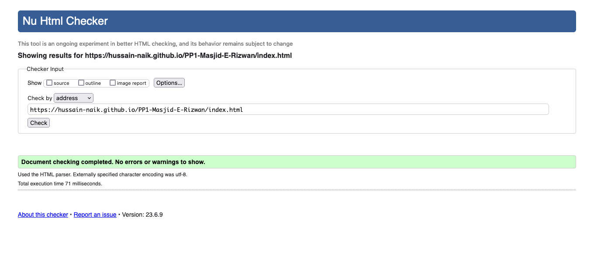
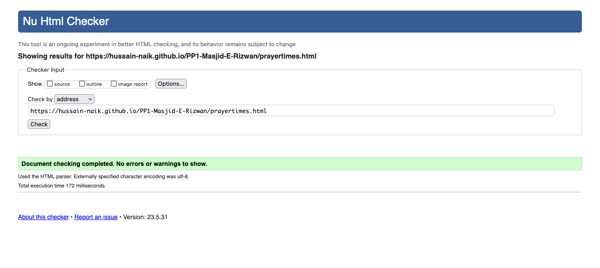
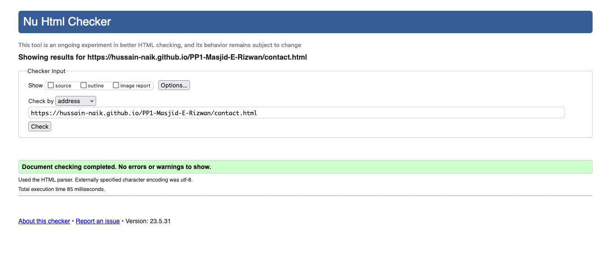
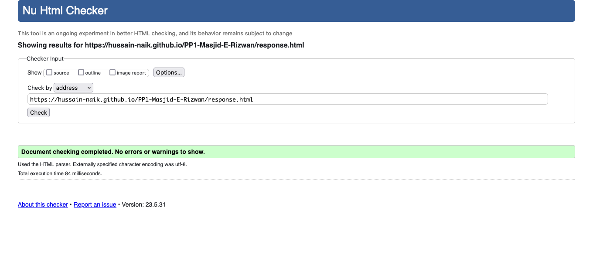
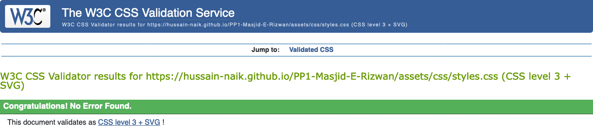
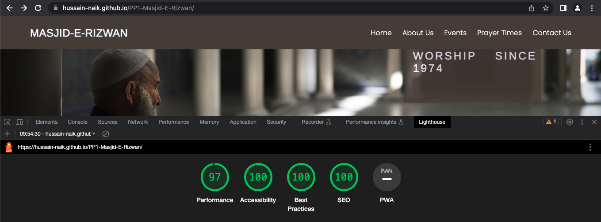
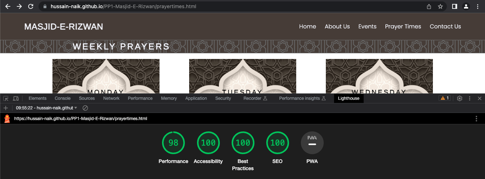
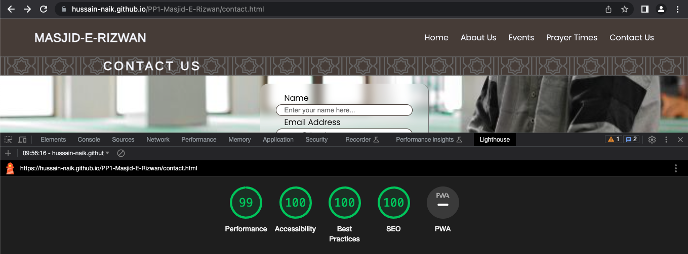
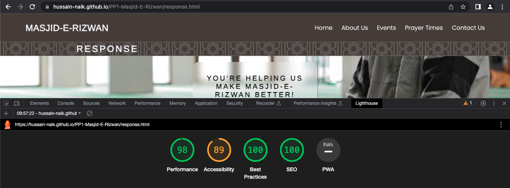

# Masjid-E-Rizwan

The Masjid-E-Rizwan website allows people to learn about the mosque and Islam and find information about prayer times, extra acitivies and facilities. The visitors of the website could quickly contact the mosque with a simple but effective contact form.

---
## Contents

- [User Stories](#user-stories)
- [Technologies Used](#technologies-used)
- [Design](#design)
    - [Wireframes](#wireframe)
    - [Color Schemes](#color-scheme)
    - [Typography](#typography)
- [Features](#features)
    - [Common Features](#common-features)
    - [Home Page](#home-page)
    - [Prayer Times Page](#prayer-times-page)
    - [Contact Page](#contact-page)
    - [Response Page](#response-page)
- [Testing](#testing)
    - [Full Testing](#full-testing)
- [Bugs](#bugs)
    - [Solved Bugs](#solved-bugs)
    - [Unsolved Bugs](#unsolved-bugs)
    - [Mistakes](#mistakes)
- [Validator Testing](#validator-testing)
    - [HTML Validator](#html-validator)
    - [CSS Validator](#css-validator)
    - [Lighthouse Reports](#lighthouse-accessibility-and-performance)
- [Deployment](#deployment)
- [Future Improvements](#future-improvements)
- [Credits](#credits)
- [Acknowledgements](#acknowledgments)

---
## User stories

- As a First Time Visitor, I want to easily understand the main purpose of the site, so I can learn more about the Mosque and Islam.
- As a First Time Visitor, I want to be able to easily navigate through the website, so I can find the content.
- As a First Time Visitor, I want to see the upcoming events to participate.

- As a Returning Visitor, I want to see information about prayer times.
- As a Returning Visitor, I want to find a way to get in contact with the Mosque, so that I can ask additional questions.
- As a Returning Visitor, I want to find community links, so that I can learn more about Masjid-E-Rizwan.

- As a Frequent User, I want to check whether there are any changes with Prayer times as they change daily.
- As a Frequent User, I want to have options for the reason to contact the company, so I can get an explicit answer to my email. 

---
## Technologies Used

- HTML
- CSS
- Font Awesome icons
- Google fonts
- Visual Studio Code
- Canva
- Git
- GitHub
- Balsamiq Wireframes

---
## Design

### Wireframe

- Desktop Mockup

- Mobile Mockup

### Color Scheme

- Main color 60% of site #F6F8FF Ghost White
- Secondary color 30% of site #50453F Taupe
- Action Color 10% of site #7BAE7F Cambridge blue

### Typography

- Google Fonts
    - [Arimo](https://fonts.google.com/specimen/Arimo?query=arimo) - used for heading and logo
    - [Poppins](https://fonts.google.com/specimen/Poppins?query=poppins) - used for remaing body text

---
## Features

### Common Features
- Nav Section
    - Positioned at the top of the page.
    - Contains logo of the company on the left side which also acts as a link back to home page.
    - Contains navigation links on the right side:
        * Home - link back to home page.
        * About Us - link to home page about section with smooth scroll.
        * Events - link to home page events section with smooth scroll.
        * Prayer Times - Link to page that displays 5 daily prayer for the week.
        * Contact Us - link to the contact form page.
    - The links have animated hover effect.

    

- Footer Section
    - Footer contains social media links that open in a new tab.
​
    
### Home Page
+ Hero Section
    - Hero section have a fixed background image with animation on load.
    - Hero section have the block section below the image that consist:
        * The name of the mosque.
        * The year the mosque was first opened.
    
    

+ About Us Section
    - About Us Section has 4 short paragraphs.
    - Tells website visitors basic information regarding the mosque and Islam.

    

+ Events Section
    - Events Section has five current activities held at the mosque.
    - Each event has a day and time assigned.
    - One image spans accoss all events for desktop view.
    - Each event include a font awesome icon.

    

+ Contact Us Section
    - Contact Section has an explicit message for the visitors of the website to contact the company.
    - Is also has a button that directs to the contact page.
​
    

### Prayer Times Page

+ Display 5 daily prayers for a week
    - Heading for each day.
    - Same background image for each day.
    - Displayed as float with 2 days displayed in a row for smaller resolutions.
    - Each days contains the 5 daily prayer start time and Jamaat(congregation) time.
    - Every prayer is set with the taupe background color
    - Jamaat time color set with call to action color

    

### Contact Page

+ Contact Form
    - Background image to span across page
    - form is centered on page.
    - form background set to blur background
    - All 3 input fields are requried
    - Form submit button having icon animation hover

    

### Response Page

+ Success Message Response
    - Background image to span across page same as contact page
    - Success message styled to look it replaced contact form.
    - Success message background set to blur background
    - Set to redirect to home page in 5 seconds
    - Home page button link also added

    

---
## Testing

### Full Testing

Full testing was performed on the following devices:

- Decktop:
  - Mac Mini 2014
- Mobile Devices:
  * iPhone SE (3rd Gen).
  * iPhone X

Each device tested the site using the following browsers:

* Google Chrome
* Safari
* Firefox

`Home Page`

| Feature | Expected Outcome | Testing Performed | Result | Pass/Fail |
| --- | --- | --- | --- | --- |
| The Sites title | Link directs the user back to the home page | Clicked title | Home page reloads | Pass |
| Home link | Link directs the user back to the home page | Clicked link | Home page reloads | Pass |
| About Us link | Link scrolls to about us section on home page | Clicked link | page scrolls down until about us section | Pass |
| Events link | Link scrolls to events section on home page | Clicked link | page scrolls down until events section | Pass |
| Prayer Times link | Link directs the user to Prayer Times page | Clicked link | Prayer Times Page loads | Pass |
| Contact Us link | Link directs the user to Contact page | Clicked link | Contact Page loads | Pass |
| Get in Touch button | Link directs the user to Contact page | Clicked button | Contact Page loads | Pass |
| Facebook icon | Link directs the user to Facebook site | Clicked link | Facebook opens in new tab | Pass |
| Twitter icon | Link directs the user to Twitter site | Clicked link | Twitter opens in new tab | Pass |
| Youtube icon | Link directs the user to Youtube site | Clicked link | Youtube opens in new tab | Pass |
| Instagram icon | Link directs the user to Instagram site | Clicked link | Instagram opens in new tab | Pass |
| All Link - hover effect | Animation of green underline when hovered | Hover over all links on page | Each link displayed correct styling when hovered over | Pass |

`Prayer Times Page`

| Feature | Expected Outcome | Testing Performed | Result | Pass/Fail |
| --- | --- | --- | --- | --- |
| The Sites title | Link directs the user back to the home page | Clicked title | Home page reloads | Pass |
| Home link | Link directs the user back to the home page | Clicked link | Home page reloads | Pass |
| About Us link | Link scrolls to about us section on home page | Clicked link | home page loads then page scrolls down until about us section | Pass |
| Events link | Link scrolls to events section on home page | Clicked link | home page loads then page scrolls down until events section | Pass |
| Prayer Times link | Link directs the user to Prayer Times page | Clicked link | Prayer Times Page loads | Pass |
| Contact Us link | Link directs the user to Contact page | Clicked link | Contact Page loads | Pass |
| Facebook icon | Link directs the user to Facebook site | Clicked link | Facebook opens in new tab | Pass |
| Twitter icon | Link directs the user to Twitter site | Clicked link | Twitter opens in new tab | Pass |
| Youtube icon | Link directs the user to Youtube site | Clicked link | Youtube opens in new tab | Pass |
| Instagram icon | Link directs the user to Instagram site | Clicked link | Instagram opens in new tab | Pass |
| All Link - hover effect | Animation of green underline when hovered | Hover over all links on page | Each link displayed correct styling when hovered over | Pass |

`Contact Page`

| Feature | Expected Outcome | Testing Performed | Result | Pass/Fail |
| --- | --- | --- | --- | --- |
| The Sites title | Link directs the user back to the home page | Clicked title | Home page reloads | Pass |
| Home link | Link directs the user back to the home page | Clicked link | Home page reloads | Pass |
| About Us link | Link scrolls to about us section on home page | Clicked link | home page loads then page scrolls down until about us section | Pass |
| Events link | Link scrolls to events section on home page | Clicked link | home page loads then page scrolls down until events section | Pass |
| Prayer Times link | Link directs the user to Prayer Times page | Clicked link | Prayer Times Page loads | Pass |
| Contact Us link | Link directs the user to Contact page | Clicked link | Contact Page loads | Pass |
| Facebook icon | Link directs the user to Facebook site | Clicked link | Facebook opens in new tab | Pass |
| Twitter icon | Link directs the user to Twitter site | Clicked link | Twitter opens in new tab | Pass |
| Youtube icon | Link directs the user to Youtube site | Clicked link | Youtube opens in new tab | Pass |
| Instagram icon | Link directs the user to Instagram site | Clicked link | Instagram opens in new tab | Pass |
| All Link - hover effect | Animation of green underline when hovered | Hover over all links on page | Each link displayed correct styling when hovered over | Pass |
| Form name input | prompt user to enter name if left empty | Clicked Send | Message displaying user to enter name | Pass |
| Form email input | prompt user to enter email if left empty | Clicked Send | Message displaying user to enter email | Pass |
| Form email input | prompt user to enter valid email | Clicked Send | Message displaying user to enter valid email | Pass |
| Form message input | prompt user to enter message if left empty | Clicked Send | Message displaying user to enter message | Pass |
| Form submit button | Direct user to response page | Clicked Send | Response page loads | Pass |
| Form submit button hover animation | Green paper plane to be displayed when hovered | Hover over send | Hover animation displayed | Pass |

`Response Page`

| Feature | Expected Outcome | Testing Performed | Result | Pass/Fail |
| --- | --- | --- | --- | --- |
| The Sites title | Link directs the user back to the home page | Clicked title | Home page reloads | Pass |
| Home link | Link directs the user back to the home page | Clicked link | Home page reloads | Pass |
| About Us link | Link scrolls to about us section on home page | Clicked link | home page loads then page scrolls down until about us section | Pass |
| Events link | Link scrolls to events section on home page | Clicked link | home page loads then page scrolls down until events section | Pass |
| Prayer Times link | Link directs the user to Prayer Times page | Clicked link | Prayer Times Page loads | Pass |
| Contact Us link | Link directs the user to Contact page | Clicked link | Contact Page loads | Pass |
| Home Page button | Link directs the user back to the home page | Clicked link | Home page reloads | Pass |
| Facebook icon | Link directs the user to Facebook site | Clicked link | Facebook opens in new tab | Pass |
| Twitter icon | Link directs the user to Twitter site | Clicked link | Twitter opens in new tab | Pass |
| Youtube icon | Link directs the user to Youtube site | Clicked link | Youtube opens in new tab | Pass |
| Instagram icon | Link directs the user to Instagram site | Clicked link | Instagram opens in new tab | Pass |
| All Link - hover effect | Animation of green underline when hovered | Hover over all links on page | Each link displayed correct styling when hovered over | Pass |
| Auto Redirect in 5 seconds | Redirects user to home page in 5 seconds | Waited 5 seconds | Home page loads | Pass |

---
## Bugs

### Solved Bugs

- Navigation logo too large was set with fixed width
    - Solved by removing width on logo and setting hr background color to fill remaining navigation

- Redirect not working on response page
    - Solved by adding index file path to url.

- Home contact section chat image background
    - Changed to img and wrapped left and right class in new div with 100% width and display flex

- Contact form textarea resizable
    - Added CSS rule to only resize vertically and added max height to input

### Unsolved Bugs

- None

### Mistakes

- Commit with more than 50 characters made early during development
- Commits made without saving displaying no changes
- Commits with spelling error

---
## Validator Testing

### HTML Validator

- Home Page no errors or warnings were found when passing through the official W3C validator.

- Prayer Times Page no errors or warnings were found when passing through the official W3C validator.

- Contact Page no errors or warnings were found when passing through the official W3C validator.

- Response Page no errors or warnings were found when passing through the official W3C validator.

### CSS Validator

- No errors or warnings were found when passing through the official W3C (Jigsaw)

### Lighthouse Accessibility and Performance

- Home Page using lighthouse in devtools I confirmed that the page is performing well, accessible and colors and fonts chosen are readable.

- Prayer Times Page using lighthouse in devtools I confirmed that the page is performing well, accessible and colors and fonts chosen are readable.

- Contact Page using lighthouse in devtools I confirmed that the page is performing well, accessible and colors and fonts chosen are readable.

- Response Page using lighthouse in devtools I confirmed that the page is performing well with exception for the Accessibilty due to the refresh meta tag

---
## Deployment

- The website was deployed to GitHub pages and can be accessed by the link: [Masjid-E-Rizwan](https://hussain-naik.github.io/PP1-Masjid-E-Rizwan/)

- In order to make a local copy of this project, you can clone it. In your IDE Terminal, type the following command to clone my repository:

- `git clone https://github.com/Hussain-Naik/PP1-Masjid-E-Rizwan.git`
---
## Future Improvements

- Add fully fuctional contact form
- Add remaining time for salaah using javascript
- Improve quality of commit message
- Improve Prayer Times page to display single current date information
- Add live annoucement feature

---
## Credits

- All images are taken from unsplash, pixabay and freepic website or created using canva.
- favicon was made using faviconer.com.
- the code for the footer was taken from the CI love running project

---
## Acknowledgments

- Due to the nature of the project the first form of acknowledegement is to Allah with the common islamic phrase Alhamdulillah (roughly equivalent to "thank God". Literally it means "all praise is to God")
- Secondly the Masjid-E-Rizwan committee for their continued support
- [Aleksei Konovalov](https://github.com/lexach91) great guidance and mentor throughout project
- [Code Institute](https://codeinstitute.net/) tutors and Slack community members for their support and help.
- [Kevin Powell](https://www.youtube.com/user/KepowOb) Flex display tutorials.
- [Hossein](https://www.youtube.com/@CodeWithHossein) Hamburger menu css tutorial.
- [Coding Artist](https://www.youtube.com/@CodingArtist) CSS hover animation tutorial.
- [Kera Cudmore](https://github.com/kera-cudmore) Comprehensive README.md guide.

---